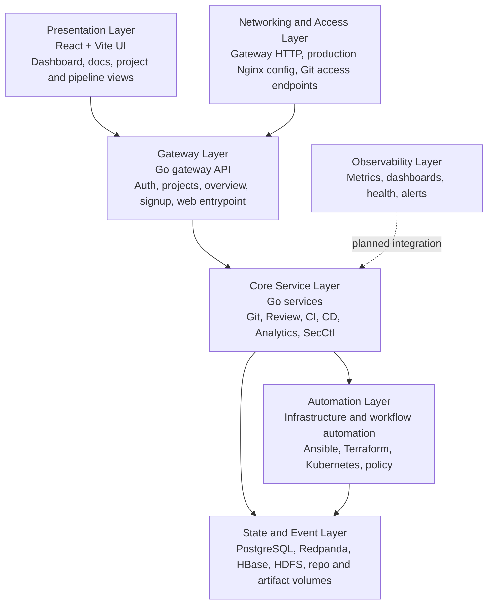

# ORCASTACK Full Platform Blueprint

## Purpose

This document defines the Go-first platform architecture implemented and targeted by this repository. It treats ORCASTACK as a React control plane, a set of Go microservices, and a private-cloud automation stack rather than as a Rails-based monolith.

## Status legend

- Implemented: present in code or runnable local/runtime configuration.
- Partial: some supporting code or docs exist, but not yet as a complete first-class platform capability.
- Planned: an intended platform capability that does not yet have a complete implementation in this repository.

## Go-first blueprint summary

## Architecture layers

### 1. Presentation layer

The operator-facing UI is implemented in React with Vite under `orcastackweb/`. It presents dashboard views, onboarding flows, project and repository surfaces, security framing, documentation access, and pipeline-oriented operator workflows.

### 2. Gateway layer

The gateway is the primary application entrypoint and is implemented in Go under `orcastackapi/cmd/orcastack-gateway/` and `orcastackapi/internal/gatewayapi/`. It handles session-oriented auth flows, local and LDAP-backed identity checks, project-facing API surfaces, and aggregated overview data for the UI.

### 3. Core service layer

ORCASTACK decomposes its platform logic into Go services rather than concentrating it inside a single application server. Current service entrypoints include:

- Git service
- Review service
- CI service
- CD service
- Analytics service
- Security control service

These services are the primary implementation vehicle for Git operations, review workflows, pipeline execution, deployment coordination, analytics, and security/policy behavior.

### 4. Automation layer

Automation is centered in infrastructure assets rather than in a separate application runtime. This layer includes:

- Terraform for environment provisioning
- Ansible for operational playbooks and lifecycle tasks
- Kubernetes manifests for platform deployment
- Policy assets for runtime and delivery governance
- Workflow definitions and automation tools under `infra/automation/`

This is where hardware-aware automation, software rollout orchestration, and private-cloud workflow control are currently expressed.

### 5. State and event layer

The local and deployment-facing data layer uses a mix of relational, event, and large-state systems:

- PostgreSQL for core metadata and service state
- Redpanda for event streaming
- HBase and HDFS for larger persistence and bootstrap data services
- Repository and artifact directories under `infra/`

### 6. Networking and access layer

Access is currently modeled through the Go gateway and supporting deployment assets. The repository includes a production Nginx configuration and Git access surfaces, but not every edge component is bundled into the local runtime stack.

### 7. Observability layer

Observability is part of the intended platform shape but is not yet delivered as a complete default runtime bundle. Health endpoints, runtime status, and operational docs exist, while dedicated metrics and dashboard services remain a planned expansion area.

## Capability matrix

| Platform capability | Go-first design | Current status | Evidence in repo | Notes |
| --- | --- | --- | --- | --- |
| Frontend control plane | React application | Implemented | `orcastackweb/`, `orcastackweb/package.json`, `orcastackweb/src/App.tsx` | React + Vite is the active UI stack. |
| Dashboard and operator navigation | UI for platform surfaces | Partial | `orcastackweb/src/App.tsx` | Broad platform surfaces exist; some features are still presentation-first. |
| Gateway and session entrypoint | Go API gateway | Implemented | `orcastackapi/cmd/orcastack-gateway/`, `orcastackapi/internal/gatewayapi/` | Primary control-plane entrypoint. |
| Identity and access | Local auth + LDAP-backed auth in Go | Partial | `orcastackapi/internal/gatewayapi/auth_ldap.go`, `orcastackapi/internal/gatewayapi/local_auth.go` | Identity is present, but deeper IAM services remain limited. |
| User profile and preferences | UI and gateway-backed user settings | Partial | `orcastackweb/src/App.tsx`, gateway session APIs | Present in the UI model, not yet a deep service surface. |
| Billing and subscription | Billing capability exposed through platform APIs or services | Planned | `sdk/nodejs/billing_sdk.js`, `sdk/python/billing_sdk.py` | SDK placeholders exist, but no billing backend service exists yet. |
| Notifications and webhooks | Go integrations and webhook handlers | Partial | `orcastackapi/internal/platform/discord/`, `orcastackapi/internal/platform/slack/` | Outbound notification paths exist. |
| Wiki and documentation | Repository-backed docs and viewer surfaces | Partial | `docs/`, `docs/wiki/`, `orcastackweb/src/App.tsx` | Docs are strong; a dedicated wiki service is not yet present. |
| Admin workflows | Operator and approval surfaces | Partial | `orcastackweb/src/App.tsx`, signup review flows | Admin behavior exists but is not fully separated as its own backend domain. |
| Git service | Dedicated Go Git service | Implemented | `orcastackapi/cmd/orcastack-git-service/`, `infra/git/repos/` | Core Git hosting surface. |
| Review service | Dedicated Go review service | Implemented | `orcastackapi/cmd/orcastack-review-service/` | Review and approval surface. |
| CI execution | Dedicated Go CI service | Implemented | `orcastackapi/cmd/orcastack-ci-service/` | Build and pipeline execution surface. |
| CD execution | Dedicated Go CD service | Implemented | `orcastackapi/cmd/orcastack-cd-service/` | Deployment coordination surface. |
| Analytics service | Dedicated Go analytics service | Implemented | `orcastackapi/cmd/orcastack-analytics-service/` | Reporting and telemetry-oriented service boundary. |
| Security control | Dedicated Go security service and policy assets | Implemented | `orcastackapi/cmd/orcastack-secctl/`, `infra/policy/` | Security-control capability exists in service and infra layers. |
| Hardware automation | Infra and workflow-driven orchestration | Partial | `infra/automation/`, `docs/Cloud-Automation-Workflows.md` | Expressed through infra automation rather than a dedicated service binary. |
| Software automation | CI/CD plus workflow-driven automation | Partial | `infra/automation/workflows/`, CI/CD services | Spread across service and infra layers. |
| Device orchestration | Device-aware operational workflows | Partial | docs and automation assets | Positioned in docs and platform framing, but not a distinct service yet. |
| PostgreSQL | Primary relational store | Implemented | `docker-compose.yml`, `infra/postgres/init/` | Present in local runtime. |
| Event streaming | Redpanda | Implemented | `docker-compose.yml` | Present in local runtime. |
| Large-state persistence | HBase and HDFS | Implemented | `docker-compose.yml` | Present in local runtime. |
| Object storage | Artifact and log object store | Planned | Artifact directories under `infra/` | On-disk artifacts exist, but object storage is not yet a bundled service. |
| Reverse proxy and TLS edge | Nginx deployment asset | Partial | `nginx.production.conf` | Production-oriented edge config exists. |
| Git over SSH | SSH access path | Planned | Git access is modeled in docs and runtime layout | No dedicated SSH service is provisioned in local runtime. |
| Observability bundle | Metrics, dashboards, alerts | Planned | docs and health surfaces | Prometheus and Grafana are not yet bundled platform services. |

## Platform conclusions

1. ORCASTACK should be described as a Go-first service platform with a React control plane.
2. The center of gravity is the Go gateway plus specialized Go services, not a monolithic application server.
3. Automation is currently strongest in infrastructure assets, workflow definitions, and deployment scaffolding.
4. The main expansion areas are billing, deeper user/account services, object storage, SSH packaging, and observability defaults.

## Near-term architecture priorities

1. Keep new platform services in Go unless there is a strong reason to introduce another runtime.
2. Clarify whether hardware automation and device orchestration should remain infra-driven or become dedicated Go services under `orcastackapi/cmd/`.
3. Add first-class object storage and observability services if they are required as part of the default platform footprint.
4. Tighten the gateway-to-service contracts so UI capabilities map cleanly onto explicit backend domains.