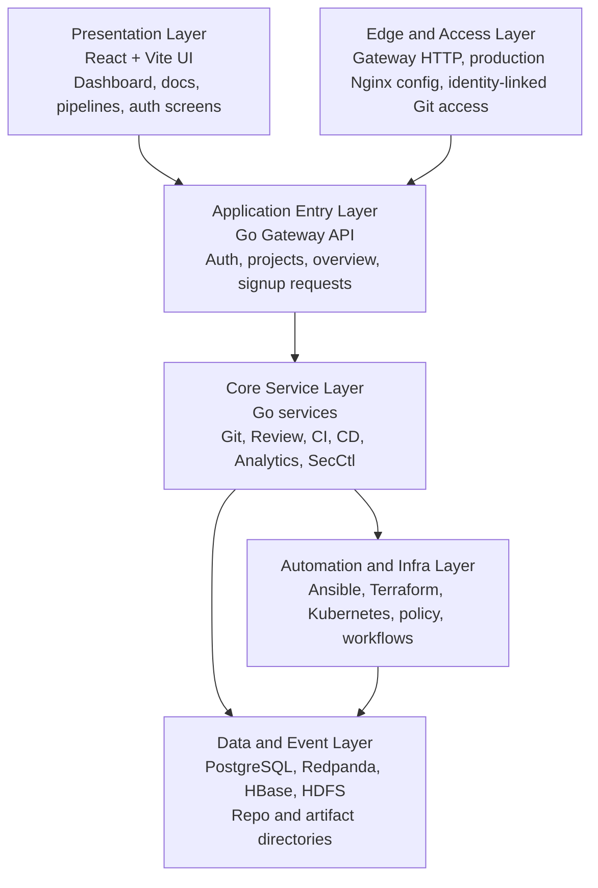

# ORCASTACK platform architecture

## Current system shape

ORCASTACK in this repository is a Go-first platform built around a React control-plane UI, a Go gateway, specialized Go services, and a private-cloud automation/runtime layer. The architecture is service-oriented, with infrastructure workflows and policy assets carrying a substantial part of the platform behavior.

## Current end-to-end flow

1. A user interacts with the React UI or a client calls the Go gateway.
2. The gateway exposes platform APIs for auth, repositories, projects, signup requests, overview data, and related control-plane flows.
3. Specialized Go services handle Git, review, CI, CD, analytics, and security-control responsibilities.
4. Infrastructure assets under `infra/` provide workflows for deployment, policy, Kubernetes, Terraform, and automation execution.
5. Platform state and bootstrap dependencies run through local and private-cloud data services such as PostgreSQL, Redpanda, HBase, and HDFS.

## Implemented architecture diagram

## Platform blueprint

ORCASTACK should be described and evolved as a Go-first platform with these implementation boundaries:

- Presentation layer in `orcastackweb/`.
- Gateway and service layer in `orcastackapi/cmd/` and `orcastackapi/internal/`.
- Automation, policy, and deployment layer in `infra/`.
- Data and event backing services through local runtime and private-cloud infrastructure.

For the detailed architecture matrix and target operating shape, see [Full Platform Blueprint](./ORCASTACK-Full-Platform-Blueprint.md).

## Infrastructure layers

- Private-cloud automation assets live under `infra/terraform/`, `infra/ansible/`, `infra/kubernetes/`, `infra/policy/`, and `infra/automation/`.
- Local bootstrap uses PostgreSQL, Redpanda, HBase, Hadoop NameNode, and Hadoop DataNode as declared in `docker-compose.yml`.
- The web UI is built from `orcastackweb/`, while the API gateway and service binaries come from `orcastackapi/`.
- A production Nginx configuration exists in `nginx.production.conf`, but Nginx is not part of the default local compose stack.

## Governance model

- Identity and access are implemented through local auth and LDAP-backed auth flows in the gateway.
- The platform models signing, attestation, RBAC, and policy enforcement across services and infrastructure assets.
- CI/CD, review, deployment, and security-control flows are represented as dedicated Go services and policy assets.

## Key repo entry points

- `orcastackweb/`: React control-plane UI.
- `orcastackapi/cmd/`: Go service entrypoints for gateway, Git, review, CI, CD, analytics, and security control.
- `orcastackapi/internal/gatewayapi/`: Auth, projects, signup, and overview API handlers.
- `infra/terraform/environments/private-cloud`: private-cloud provisioning.
- `infra/kubernetes/platform`: cluster-level platform services.
- `infra/policy`: attestation and runtime governance.
- `infra/automation/workflows`: automation execution surfaces.
